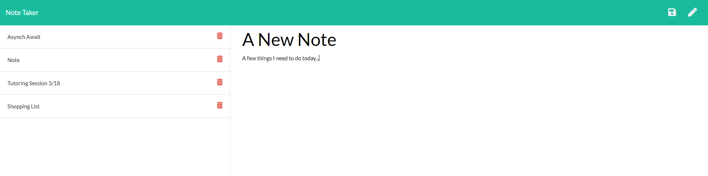

# Note_Taker

## Description
An application used to write and save notes using express.js on the back end to save and retrieve data. HTTP request methods get, post, and delete are utilized to retrieve notes, post new notes, and delete notes that are no longer needed. 

Click the link below to try it out. The site is hosted by Heroku.

**[Check it out here!](https://enigmatic-garden-40710.herokuapp.com/)**

Routing allows the user to visit a landing page, and a notes page. API routes retrieve, and store note data. This application utilizes node's fs module, path module, and npm's express and uuidv4 packages.

## Table of Contents
* [Usage](#usage)
* [Credits](#credits)
* [License](#license)

## Usage
* **The Finished Product**  

## Credits
Here are a few resources that helped me get this project knocked out!
* [Node.js documentation writeFileSync](https://nodejs.org/api/fs.html#fs_fs_writefilesync_file_data_options)
* [w3schools array filter method](https://www.w3schools.com/jsref/jsref_filter.asp)
* [npm uuid](https://www.npmjs.com/package/uuid)
* [Node.js documentation on readFile](https://nodejs.org/en/knowledge/file-system/how-to-read-files-in-nodejs/)

## License
* Link for more information: (https://opensource.org/licenses/MIT)
* MIT License

      Copyright (c) [year] [fullname]
      
      Permission is hereby granted, free of charge, to any person obtaining a copy
      of this software and associated documentation files (the "Software"), to deal
      in the Software without restriction, including without limitation the rights
      to use, copy, modify, merge, publish, distribute, sublicense, and/or sell
      copies of the Software, and to permit persons to whom the Software is
      furnished to do so, subject to the following conditions:
      
      The above copyright notice and this permission notice shall be included in all
      copies or substantial portions of the Software.
      
      THE SOFTWARE IS PROVIDED "AS IS", WITHOUT WARRANTY OF ANY KIND, EXPRESS OR
      IMPLIED, INCLUDING BUT NOT LIMITED TO THE WARRANTIES OF MERCHANTABILITY,
      FITNESS FOR A PARTICULAR PURPOSE AND NONINFRINGEMENT. IN NO EVENT SHALL THE
      AUTHORS OR COPYRIGHT HOLDERS BE LIABLE FOR ANY CLAIM, DAMAGES OR OTHER
      LIABILITY, WHETHER IN AN ACTION OF CONTRACT, TORT OR OTHERWISE, ARISING FROM,
      OUT OF OR IN CONNECTION WITH THE SOFTWARE OR THE USE OR OTHER DEALINGS IN THE
      SOFTWARE.
